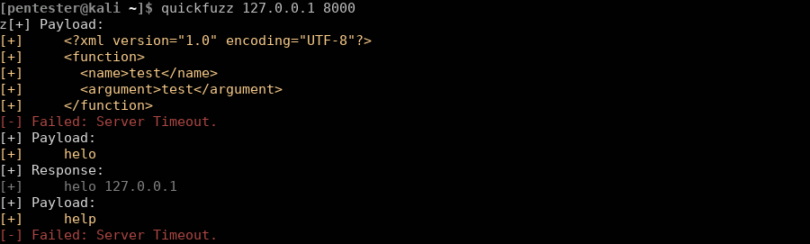
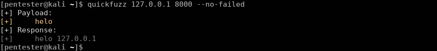
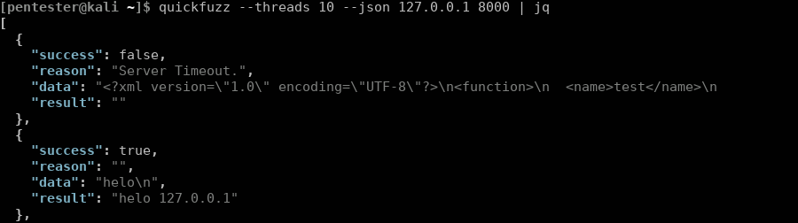

# quickfuzz

quickfuzz is a python script which helps you identifying unknown ports.



### Description

-----

During an ordinary system pentest we often encounter ports which were flagged as
unknown by nmap. However, even if nmap does not know which service runs behind the
corresponding ports, they may return some output that can be useful for further 
research and may be interesting for the pentester. 

quickfuzz makes identifying services behind ports relatively easy. Upon started, it
just sends a list of specific payloads to the corresponding port and waits for a
response. If a response is found, it will display the corresponding content in a format
that cannot be overlooked easily. 


### Installation

-----

1. **Via setup.py**
    
    To install *quickfuzz*, make sure you have Python 3.6 or greater installed. 
    Then run these commands from the command prompt:

        $ pip3 install -r requirements.txt --user
        $ python3 setup.py install --user


2. **As pip package** (recommended)  

    If you want to generate a pip package instead, run the following command from the command prompt:

        $ python3 setup.py sdist

    You can then install the tool via pip using:

        $ pip3 install -r requirements.txt --user
        $ pip3 install dist/quickfuzz-1.0.0.tar.gz --user


### Example Workflow

-----

Whenever you encounter a port that was flagged as **unknown** by nmap, just try to scan it
with quickfuzz and see if you get something back. Invoking quickfuzz is easy as typing:

```bash
pentester@kali:~$ quickfuzz 127.0.0.1 8000
```

The corresponding error codes can now be looked up in your favorite search engine and may enable
you to identify the service that is running on this port.


### Features

-----

Here I want to list some features of quickfuzz that might be handy for you:

##### No-Failed

The default output of quickfuzz does show negative and positive results together. While color
highlighting makes it already quite easy to distinguish between both of them, you can also 
use the **--no-failed** switch to get rid of negative results. Your output will then look like
this:




##### Threading

The job that is done by quickfuzz implies that it has to wait for responses for the most of its 
runtime. This makes quickfuzz an excellent canidate for multi threading. Using the **--threads**
parameter, you can start with many fuzzing threads as once and might get you results faster. However,
notice that unknown ports can be blocking and threading could lead to false negatives in this case.


##### JSON Formatted Output

If you want to include quickfuzz in your favorite scanning scripts, you can use the **--json** switch
to make output processing more easily. The output will be presented as json and is easy to parse,
as shown in the following screenshot:




##### Optimization

Some ports are blocking for some time, others need longer to respond. Using options like **--connect-timeout**,
**--timeout** or **--retries** you can adjust the internal behavior of quickfuzz to your current situation.


##### Library

The actual code of the quickfuzz executable is super small. All functions required for fuzzing are implemented
as library functions inside the quickfuzz package. If the implementation of the quickfuzz binary does not matches
your requirements, just use the quickfuzz library and create your own wrapper around it.


### How to Contribute

-----

If you have discovered a good opening payload, that revealed a service for you during the pentest, 
do not hesitate to contact us. We try to collect a decent amount of such payloads to give you a more
reliable service detection.

*Copyright 2019, Tobias Neitzel and the *quickfuzz* contributors.*
